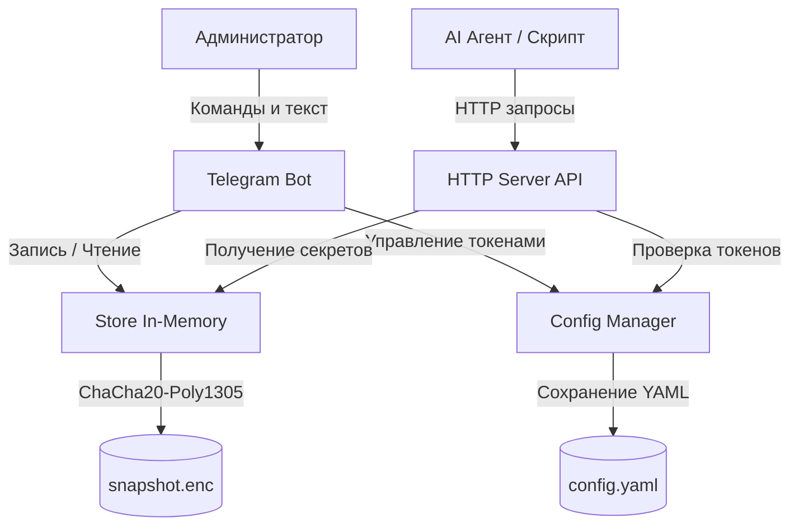

# Архитектура Lab Vault

В данном документе описана архитектура проекта, взаимодействие ключевых компонентов и механизмы работы под капотом (шифрование, хеширование, FSM).

## Архитектурная диаграмма

## Ключевые компоненты

1. **Store (Хранилище секретов)**: Потокобезопасное in-memory хранилище (использует `sync.RWMutex`). Данные могут храниться в зашифрованном виде (sealed mode). Регулярно выгружается на диск в виде зашифрованного бинарного файла снапшота (`snapshot.enc`).
2. **Config (Конфигурация и токены)**: Управляет настройками, проектами и выданными токенами. Хранит свое состояние в `config.yaml`. Обеспечивает атомарное сохранение через временные файлы и автоматическую очистку просроченных токенов (background cleanup worker).
3. **Bot (Telegram Bot)**: Интерфейс управления секретами для администратора (ЗавЛаб). Поддерживает сложные многошаговые диалоги благодаря встроенной логике FSM (конечного автомата).
4. **Server (HTTP API)**: Отвечает за предоставление секретов агентам и внешним скриптам по токенам. Защищен IP-rate limiter'ом. Реализует концепцию одноразового доступа (one-time consume).

## Логика под капотом

### Шифрование (Argon2id + ChaCha20-Poly1305)
Данные на диске (а в режиме sealed mode — и в оперативной памяти) защищены криптографически:
- **Генерация ключа**: Для генерации симметричного ключа используется алгоритм формирования ключа `Argon2id`. В качестве параметров выступают переменная окружения `VAULT_PASSWORD` и 16-байтная случайная соль. Параметры Argon2id: `time=3`, `memory=64MB`, `threads=4`.
- **Алгоритм шифрования**: Применяется AEAD-алгоритм `ChaCha20-Poly1305` со случайным 12-байтным `nonce`. Снапшот на диске содержит соль, nonce и зашифрованный payload, обеспечивая надежную защиту even at rest.

### Хеширование токенов (SHA-256)
Когда бот генерирует токен доступа (через криптографически стойкий `crypto/rand`), сам токен в открытом виде предоставляется пользователю (администратору) лишь единожды. В `config.yaml` и оперативной памяти сохраняется только его **SHA-256 хеш** (через функцию `hashToken`). Это защищает от кражи токенов в случае утечки файла конфигурации.

### Конечный автомат (FSM) Telegram-бота
Чтобы поддерживать создание секретов и проектов, бот использует машину состояний (Finite State Machine).
- Сессия каждого пользователя (идентифицируется по `chatID`) содержит текущее состояние (например, константы `stateWaitingName`, `stateWaitingValue`, `stateWaitingProjectID` и т.д.).
- Сессии имеют TTL (Time To Live = 30 минут) и периодически очищаются (через `startSessionCleaner`).
- Переходы между состояниями позволяют боту собирать сложную структуру данных, ожидая последовательного ввода (сначала имя секрета, затем — его значение).

### Взаимодействие модулей при потреблении токена
1. Запрос поступает на `Server` (например, `/access/<token>`).
2. Срабатывает защита `ipRateLimiter`, защищающая от брутфорса (10 запросов в минуту на IP-адрес).
3. Токен из URL пропускается через `SHA-256`, и полученный хеш ищется в модуле `Config` (среди `SecretTokens` или `ProjectTokens`).
4. В рамках одной блокировки (mutex) проверяется TTL токена, статус `Revoked`. Если токен одноразовый, он **немедленно удаляется** из памяти, и `Config` перезаписывает файл `config.yaml` на диске.
5. `Server` обращается в `Store`, расшифровывает значение (sealedDecrypt) и отдаёт клиенту.
